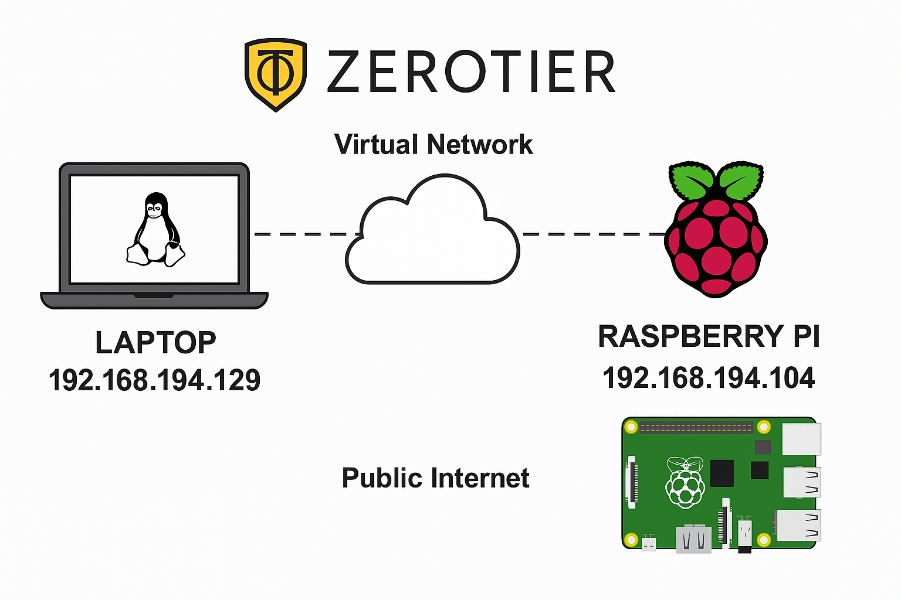

[](https://www.python.org/) 
 
 

[](https://discord.gg/bf6rWDbJ) 
[](https://www.docker.com/) 
[](https://www.linux.org/)
[](https://opensource.org/licenses/MIT)
[](https://www.linkedin.com/in/roberto-carlos-toapanta-g/) 
[](#registro-de-cambios) 
 

<p align="right"><strong>Español</strong> | <a href="README.md">English</a></p>

# <p align="center">Zerotier rpi setup</p>

Script Bash para instalar, unir, verificar y desinstalar ZeroTier One en Raspberry Pi (y sistemas basados en Debian/Ubuntu en general). Automatiza la instalación del servicio, la unión a una red, la espera de autorización en ZeroTier Central y una prueba de conectividad opcional con ping. También permite abandonar una red o desinstalar ZeroTier.

---

## ✨ Características

- Detecta si el equipo es una Raspberry Pi e informa el modelo (Raspberry Pi 3/5 y otros). También muestra el sistema operativo y la arquitectura detectada.
- Instala ZeroTier si no está presente (y dependencias mínimas). 
- Habilita y reinicia el servicio `zerotier-one`.
- Se une a la red indicada y espera hasta 180 segundos a que autorices el equipo en ZeroTier Central.
- Muestra un resumen: estado del cliente (`zerotier-cli status`), redes a las que pertenece (`listnetworks`), interfaces `zt*` y la IP ZeroTier asignada (IPv4).
- Si se indicó `-p`, realiza una prueba de ping al peer configurado.

## 🛠️ Requisitos del Sistema

- Sistemas soportados:
  - Debian 11/12, Ubuntu 20.04/22.04/24.04 (Server/Desktop)
  - Raspberry Pi OS Bullseye/Bookworm (arm64/armhf)
  - Otros derivados de Debian pueden funcionar, pero no están probados
- Permisos: cuenta con privilegios de administrador (sudo) para instalar paquetes y gestionar servicios.
- Red y puertos:
  - Salida a Internet vía HTTPS (TCP 443) para descargar el instalador.
  - Tráfico UDP 9993 abierto hacia/desde Internet (requerido por ZeroTier).
  - Si usas UFW: `sudo ufw allow 9993/udp`
- Arquitecturas compatibles: `amd64/x86_64`, `arm64/aarch64`, `armhf`.
- Recursos mínimos: ~50 MB libres en disco y ~50 MB de RAM para el servicio.
- Cuenta y red ZeroTier:
  - Una cuenta en https://my.zerotier.com y el Network ID de tu red.
  - Opcional: IP ZeroTier de un peer para pruebas de ping (`-p`) y cantidad de paquetes (`-t`).

Nota: si ya tienes ZeroTier instalado, el script lo detecta y no lo reinstala.

## 🗂️ Estructura del proyecto

```
zerotier-rpi-setup/
├── zerotier-rpi-setup.sh   # Script principal: instala, une, espera autorización y prueba conectividad
└── README.md               # Documentación, guía de uso, solución de problemas y registro de cambios
```

## 🚀 Implementación y despliegue

<p align="center">
  
</p>
<p align="center"><sub>Figura 1. Arquitectura de conexión con ZeroTier</sub></p>

1) 📦 Preparación
   - Clona o copia este repositorio en el equipo objetivo (Raspberry Pi o Ubuntu).

   ```bash
   $ git clone git@github.com:rotoapanta/zerotier-rpi-setup.git
   ```

2) 🛠️ Despliegue con el script (recomendado)
   ```bash
   $ chmod +x zerotier-rpi-setup.sh
   $ sudo ./zerotier-rpi-setup.sh -n <NETWORK_ID>
   ```
   - El script instala dependencias si faltan, instala ZeroTier, habilita y reinicia el servicio `zerotier-one`, se une a la red y espera autorización.

3) 🔐 Autorizar en ZeroTier Central
   - https://my.zerotier.com → Networks → tu_red → Members → marcar "Auth" al nuevo miembro.

4) 🔍 Verificar estado e IP
   ```bash
   $ sudo zerotier-cli status
   $ sudo zerotier-cli listnetworks
   $ ip -o -4 addr show | awk '/zt/{print $4}'
   ```

5) 🧱 Firewall (si usas UFW)
   ```bash
   $ sudo ufw allow 9993/udp
   ```

6) 📜 Servicio y logs
   ```bash
   $ sudo systemctl enable zerotier-one
   $ sudo systemctl status zerotier-one
   $ sudo journalctl -u zerotier-one -n 200 --no-pager
   ```

7) 🧹 Reversión / limpieza
   ```bash
   # Salir de la red
   $ sudo zerotier-cli leave <NETWORK_ID>
   # o con el script
   $ sudo ./zerotier-rpi-setup.sh -n <NETWORK_ID> --leave

   # Desinstalar ZeroTier
   $ sudo apt purge zerotier-one -y && sudo apt autoremove -y
   # o con el script
   $ sudo ./zerotier-rpi-setup.sh --uninstall
   ```

## 🆘 Ayuda y flags

```text
Uso: sudo ./zerotier-rpi-setup.sh -n <NETWORK_ID> [-p <PEER_IP>] [-t <PING_COUNT>] [--leave] [--uninstall]
  -n   ID de red de ZeroTier (obligatorio, ej. 8056c2e21c000001)
  -p   IP virtual ZeroTier de un peer para probar ping (opcional)
  -t   Número de pings al probar (por defecto: 4)
  --leave     Abandona la red especificada (-n requerido)
  --uninstall Desinstala ZeroTier (purge)
Ejemplos:
  sudo ./zerotier-rpi-setup.sh -n 8056c2e21c000001
  sudo ./zerotier-rpi-setup.sh -n 8056c2e21c000001 -p 10.147.20.12 -t 5
```

- -n: ID de red de ZeroTier (obligatorio).
- -p: IP ZeroTier (IPv4) de un peer para probar conectividad mediante ping.
- -t: Cantidad de paquetes a enviar en la prueba de ping.
- --leave: Abandona la red especificada (no se desinstala el servicio).
- --uninstall: Desinstala completamente ZeroTier.
- -h | --help: Muestra la ayuda.

## 🔗 Conectar un nuevo dispositivo

Prerequisitos:
- Tener el `NETWORK_ID` de tu red (en https://my.zerotier.com → Networks).
- Acceso para autorizar miembros en ZeroTier Central.

1) Linux / Raspberry Pi (Debian/Ubuntu)
   - Instala y une usando este script (recomendado):
     ```bash
     $ chmod +x zerotier-rpi-setup.sh
     $ sudo ./zerotier-rpi-setup.sh -n <NETWORK_ID>
     ```
   - Alternativa manual:
     ```bash
     $ curl -s https://install.zerotier.com | sudo bash
     sudo zerotier-cli join <NETWORK_ID>
     ```

2) Windows
   - Instala ZeroTier One desde https://www.zerotier.com/download/.
   - Join Network con `<NETWORK_ID>`, autoriza en Central, verifica IP.

3) iPhone (iOS)
   - App Store: https://apps.apple.com/app/zerotier-one/id1085978097
   - Únete con `<NETWORK_ID>`, permite el perfil VPN, activa ZeroTier en Ajustes si es necesario, autoriza en Central.

## 🧩 Solución de problemas

- ⚠️ Miembro en PENDING y sin IP
  - Autoriza en https://my.zerotier.com → Networks → tu_red → Members (checkbox Auth).
  - Revisa que el pool de direcciones (Auto-Assign) esté configurado.
- 🛡️ Sin IP ZeroTier
  - Verifica pools/reglas, reinicia el servicio: `sudo systemctl restart zerotier-one`.
- 🔌 Sin conectividad con el peer
  - Ambos miembros en la misma red, autorizados, con IP; revisa firewall (ICMP), rutas y que el peer esté online.
- 📜 Logs/estado del servicio
  ```bash
  sudo systemctl status zerotier-one
  sudo journalctl -u zerotier-one -n 200 --no-pager
  ```

## 💬 Comentarios

Si tienes comentarios o sugerencias, contáctanos en robertocarlos.toapanta@gmail.com

## 🛟 Soporte

Para soporte, escribe a robertocarlos.toapanta@gmail.com o únete a nuestro canal de Discord.

## 📄 Licencia

[MIT](https://opensource.org/licenses/MIT)

## 👥 Autores

- [@rotoapanta](https://github.com/rotoapanta)

## 📜 Registro de cambios

Este proyecto sigue el formato Keep a Changelog y Semantic Versioning.

[Unreleased]
- 

- 1.0.0 – 2025-09-23
  - Lanzamiento estable: progreso “Paso X/Y”, guía multi-plataforma, sugerencias simplificadas y README reorganizado.

- 0.3.0 – 2025-09-23
  - Prelanzamiento con guía “Conectar un nuevo dispositivo” e integración iOS.

- 0.1.0 – 2025-09-23
  - Versión inicial del script.

## ℹ️ Más Información

Enlaces útiles:
- ZeroTier Central: https://my.zerotier.com
- Descargas ZeroTier: https://www.zerotier.com/download/
- Documentación CLI: https://docs.zerotier.com/zerotier/cli

## 🔗 Enlaces

[](https://www.linkedin.com/in/roberto-carlos-toapanta-g/)

[](https://twitter.com/rotoapanta)
